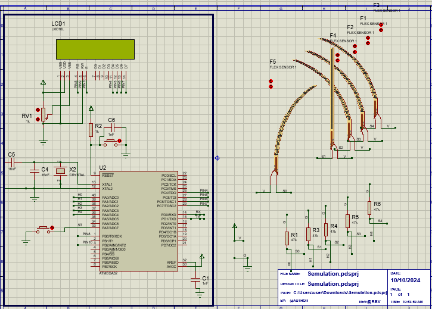

# Deaf Communication System Using Flex Sensors

## 🤟 Project Overview  
This system helps deaf users communicate using hand signs.  
Finger bending is measured using flex sensors and converted into readable messages displayed on LCD.

This allows gesture-based communication.

---

## 🧠 Features  
✔ Reads finger movement using resistance changes  
✔ Converts analog signal → digital message  
✔ Displays decoded text on LCD  
✔ Buzzer feedback  
✔ Error detection for unreadable gestures  

---

## 🛠 Hardware Design  

| Component | Function |
|-----------|----------|
| Flex Sensors (5 Units) | Detect bending of fingers |
| ATmega32 MCU | Signal processing |
| LCD Display | Message output |
| ADC Channels | Signal conversion |
| LEDs | Status indication |

---

## 🖥 Circuit Diagram  

 

> Circuit includes ADC conditioning, LCD connections, and sensor inputs.

---

## 🛠 Tools Used  

- Proteus Schematic Design  
- Embedded C  
- Atmel Studio  
- ADC Interface Programming  

---

## 📂 Repository  
👉 https://github.com/Karem1heikal/ATmega32_Projects/tree/main/Deaf%20Communication%20System  

---
