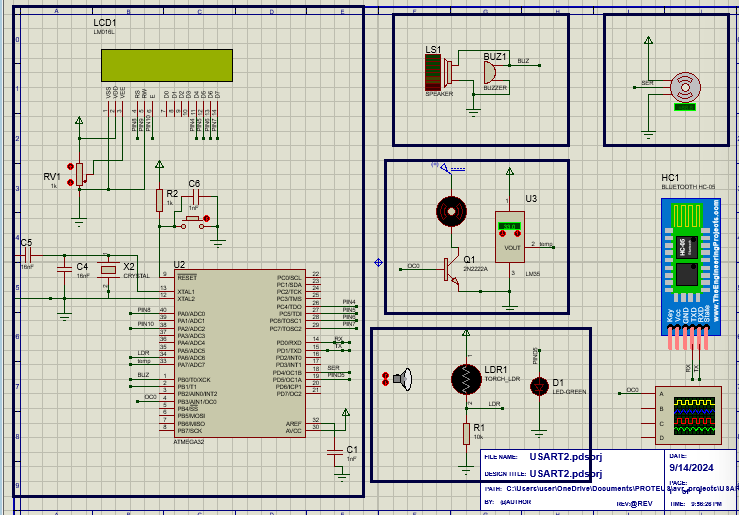

# Smart Home System Controlled via Bluetooth  

## 🏡 Overview  
This is a smart home automation system based on **ATmega32** that enables remote wireless control of home appliances using a Bluetooth-based mobile application.

The system controls:
- Room lights
- Fan
- Buzzer
- LCD status display

It also includes password-based access to secure home control.

---

## 🧠 Features  
✔ Control home devices wirelessly  
✔ LCD shows system mode and status  
✔ UART communication with HC-05  
✔ Password authentication  
✔ Fully simulated on Proteus  

---

## ⚙️ System Architecture  

| Module | Description |
|---------|-------------|
| HC-05 Module | Bluetooth communication |
| LCD 16×2 | Status display |
| LEDs / Relays | Device simulation |
| Push Buttons | Local control |
| Buzzer | Alerts |

---

## 🖥 Circuit Design  

Below is the circuit diagram designed and simulated using **Proteus**:

> The design includes proper schematic wiring, VCC/GND rail organization, labels, and signal flow clarity.

---

## 🛠 Tools & Technologies Used  

- Proteus simulation  
- Embedded C  
- Atmel Studio  
- UART Communication  
- LCD drivers  
- GPIO APIs  

---

## 📂 Repository  
👉 https://github.com/Karem1heikal/ATmega32_Projects/tree/main/Smart_Home_Controlled_BY_BlueTooth  

---

