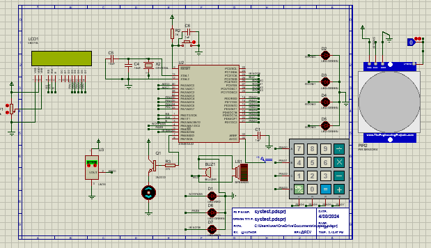

# 🏡 Smart Home System – Embedded + IoT

This project is a complete Smart Home automation system implemented using an **ATmega32** microcontroller along with an IoT extension using an **ESP32** controller.  
The system is divided into two major parts:

---

# 🔐 1) Embedded System Part

This part is responsible for local system control and consists of two main subsystems:

---

## 1.1) Security System  
Before accessing the home control features, the user must enter a password.

### 🔑 How it works:
- User has **3 attempts** to enter the correct password.
- If password is correct → system moves to mode selection screen.
- If password is incorrect 3 times:
  - A buzzer alarm is activated for a short duration.
  - User is redirected to retry again.

This ensures safe access to the embedded control system.

---

## 1.2) Mode Selection System  
Once authenticated correctly, the user can choose between **four smart modes**:

---

### 🌀 1.2.1) Air Conditioning Mode  
This mode provides automatic temperature-based fan control.

The operation flow:
1. System measures temperature using **LM35 sensor**  
2. Compares measured value with the predefined threshold  
3. If temperature > threshold → fan turns ON  
4. If temperature <= threshold → fan turns OFF  

➡️ Ensures automatic thermal comfort without manual intervention.

---

### 🛡️ 1.2.2) Safety Security Mode  
Used when the user is outside their home and wants intrusion alerting.

- A **PIR motion sensor** is activated
- If any unknown movement is detected, the system triggers a buzzer alarm

➡️ Helps detect unwanted movement in the house.

---

### 💡 1.2.3) Room Lighting Mode  
User can turn **ON/OFF room lights manually**.

- Each room is represented using LED indicator  
- Provides full manual override control

---

### 🌀 1.2.4) Fan System Mode  
This mode enables manual ON/OFF control for fans in the house.

It overrides automatic temperature control.

---

---

# 🌐 2) IoT Control Part  

In this part, the system enables home control using smartphone connectivity via **Blynk IoT Application** through ESP32 Wi-Fi module.

### ✔ Available IoT Modes:
- Lighting Control  
- Fan Control  
- Security System Control  

➡️ User can monitor and control home functions from anywhere.

---

# 🧠 System Architecture Summary

| Feature | Embedded Part | IoT Part |
|---------|--------------|----------|
| Access security | ✔ | ❌ |
| Fan auto control | ✔ | ❌ |
| Manual fan control | ✔ | ✔ |
| Manual light control | ✔ | ✔ |
| Motion detection | ✔ | ✔ |
| Smartphone control | ❌ | ✔ |

---

# 🧩 System Components

---

## 🔧 Embedded System Hardware
- ATmega32 Microcontroller  
- LCD 16x2  
- Keypad 4x4  
- Buzzer  
- Fan  
- 4 LEDs representing rooms  
- LM35 Temperature Sensor  

---

## 🌐 IoT System Hardware
- ESP32 MCU  
- Buzzer  
- Fan  
- PIR Motion Sensor  
- Room Lighting Module  

---

---

# 🖥 Simulation Preview  

> Below is the Proteus simulation diagram used during system design and testing:

> Ensure this file exists in the repository in a folder named:  
➡ `/Images/simulation.png`

---

# 📂 Project Repository  
🔗 https://github.com/Karem1heikal/ATmega32_Projects/tree/main/smart-home-system_Controled%20by%20KeyPad/smart-home-system-main/SYS_smart1  

---

# 🏁 Final Notes  
✔ Designed using Proteus simulation  
✔ Complete embedded-IoT integration  
✔ Fully implemented and functional  
✔ Supports security, safety, and comfort automation  

---

💡 Recommended Improvements:
- Add mobile notification alerts via Blynk Cloud  
- Add EEPROM password saving  
- Support dual-user access  
- Add real-time clock for timed automation  

---
